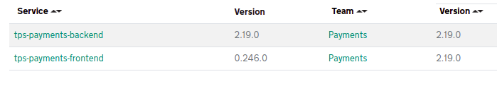

# tps-payments-backend

The Telephony Payments System (TPS) allows HMRC operatives, authenticated via Stride, to assist with customer card payments over the telephone.

For more info read https://github.com/hmrc/tps-payments-frontend

## COR (Collection of Routines)

The frontend (tps-payments-frontend)
and backend (tps-payments-backend) operate in tandem,
both built using the same technology stack:
Scala, the Play framework, and MDTP's "uk.gov.hmrc.bootstrap".
They share the same model, and for this model,
they utilize consistent JSON serializers
when sending requests to the backend and receiving responses.

Consequently, to prevent code redundancy
(which often diverges when copied and pasted),
it made sense to encapsulate the shared model classes
within a library and utilize them in both systems.

Given that the library is exclusively for the frontend/backend pairing
and contains no logic,
it is named COR (Collection of Routines).
This differentiates it from typical libraries,
which, in the realm of microservices on MDTP,
tend to have a negative reputation.

### COR Rules

The COR library should be very thin and contain no logic,
only definitions of case classes that express the model used
in both frontend and backend.

The case classes are defined along with JSON serializers used
to transport data over the REST protocol.

The COR can include connector code (based on Platform's HttpVerbs)
to access backend endpoints.
This connector is tested in the backend against the actual production implementation,
forming a reliable component for frontend use.
Since it relies on model case classes defined in the COR,
it automatically addresses serialization issues,
reducing the potential for runtime problems.

The COR should not introduce any transitive dependencies.
For JSON serialization, it should only utilize serializers provided
by the play-framework, along with enumeratum (`enumeratum-macros`)
and `play-json-derived-codecs`.
Since those libraries are widely used across most Payments microservices,
it's okay to add them as transitive dependencies to COR.

The COR can include test data in a separate artifact.
It's logical to reuse the consistent representation of the `Journey` class
in its various states across different tax regimes.
Significant effort was made to ensure this representation
closely mimics what would occur during a production run.
This test data should be utilized in the Frontend when mocking Backend responses
in integration tests.
This approach helps prevent pitfalls
often encountered when creating wiremock responses emulating backend behaviour
based on assumptions that aren't subsequently verified
during backend modifications.
By utilizing the same test data
in both the backend and frontend,
the quality of tests is enhanced
and the overall workflow becomes more convenient.

**Private Usage:**
The COR dependency is for internal use only.
This code is restricted to this frontend and its corresponding backend microservice.

### Aligning COR versions

When releasing the Frontend and Backend,
ensure that both services use the same COR version.
It's essential that release candidates contain
matching COR versions.
Failing to do so may result in incompatibilities
in the model and APIs used for communication
between the Frontend and Backend.

Verification can be done using the [dependency explorer](https://catalogue.tax.service.gov.uk/dependencyexplorer/results?group=uk.gov.hmrc&artefact=tps-payments-backend-cor-journey&versionRange=%5B0.0.0%2C%5D&asCsv=false&team=&flag=latest&scope%5B%5D=compile).

For instance, in the example below,
`tps-payments-frontend v0.246.0` and
`tps-payments-backend v2.19.0`
both use COR version `2.19.0`.

### License

This code is open source software licensed under the [Apache 2.0 License]("http://www.apache.org/licenses/LICENSE-2.0.html").

